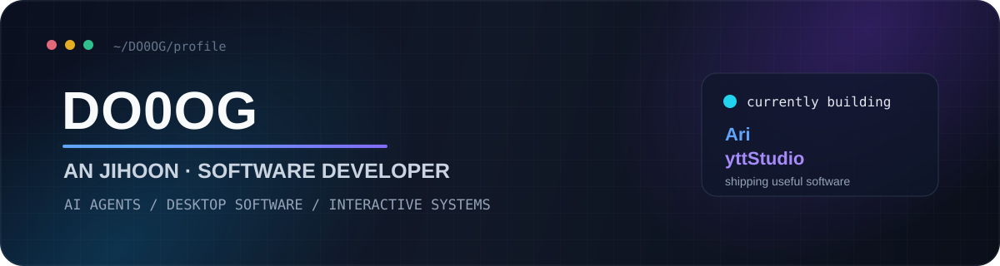

 

**Building AI-powered desktop software, developer tools, and interactive systems.**

---

## Selected Work

### [Ari — AI Voice Assistant](https://github.com/DO0OG/Ari-VoiceCommand)

Open-source **Windows AI voice assistant and autonomous desktop agent** built around voice interaction, desktop automation, local AI, and extensibility.

`Python` `PySide6` `MCP` `Ollama` `STT/TTS` `Plugin System`

- Wake word, multilingual speech recognition, and natural voice responses
- Autonomous tool execution and desktop automation with verification
- Local LLM workflows, MCP tools, plugins, skills, and remote-control integrations

 

### [yttStudio — YTT/SRV3 Subtitle Editor](https://github.com/DO0OG/yttStudio)

Cross-platform **WYSIWYG editor for advanced YouTube subtitles**, designed to edit positioning, styling, timing, effects, and keyframes directly over video.

`C#` `.NET 10` `Avalonia` `libmpv` `Cross-platform`

- Direct-on-video subtitle placement and editing
- Timeline, multi-keyframe motion, karaoke, visual effects, and format validation
- Windows, macOS, and Linux releases with automated update support

 

### [CustomLauncher — Cross-platform Minecraft Launcher](https://github.com/DO0OG/CustomLaucncher)

A configurable **Minecraft server launcher and distribution client** for Windows, macOS, and Linux.

`C#` `.NET 8` `Avalonia` `Microsoft/Xbox Auth` `GitHub Actions`

- Microsoft account authentication and session management
- Incremental content delivery with integrity checks, rollback, and mod/resource-pack management
- Cross-platform packaging and automated build/test workflows

---

## Tech

### Core

### Desktop & Interactive

### Tooling & Systems

---

## Current Focus

- **AI agents & local-first AI** — voice interfaces, tool use, MCP, local models, automation
- **Cross-platform desktop engineering** — maintainable applications with .NET/Avalonia and Python/PySide6
- **Shipping reliable software** — CI, packaging, update systems, distribution, testing, and recovery flows
- **Interactive systems** — game development, UI tooling, and user-facing automation

---

## Background

**Computer Engineering** · Seowon University  
**Unity Bootcamp** · Korea Chamber of Commerce and Industry

---

## GitHub Stats

---

Build useful things. Make them reliable. Keep improving them.

